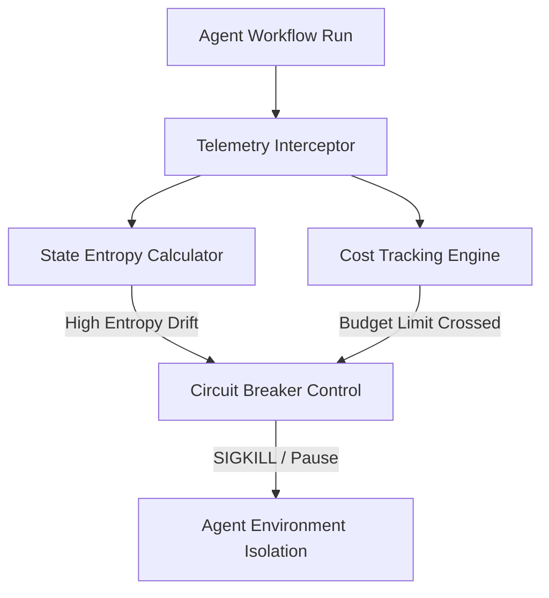

# entropy-zero
Captain Powell
An open-source telemetry and static analysis engine designed to monitor autonomous agent workflows, calculate runtime state entropy, and enforce algorithmic cost circuit breakers.

---

## ⚡ Overview

When multi-agent systems run autonomously, they risk entering non-deterministic execution loops, state stagnation, or token-spending cascades. `entropy-zero` provides real-time telemetry into agentic execution paths, measuring the deterministic decay (entropy) of system states and killing rogue processes before they exhaust computational or financial budgets.

### Core Pillars
* **State Entropy Calculation:** Quantifies workflow divergence and state predictability using information-theoretic metrics.
* **Algorithmic Circuit Breakers:** Protects LLM/infra spend by intercepting runtime calls when cost or step limits cross mathematical variance thresholds.
* **Static Graph Analysis:** Evaluates agent execution graphs prior to deployment to isolate potential infinite loops or deadlocks.

---

## 📐 Mathematical Framework

The engine evaluates system state entropy ($H$) across agentic state transitions over a given time window. The runtime state entropy is calculated as:

$$H(X) = - \sum_{i=1}^{n} P(x_i) \log_2 P(x_i)$$

Where $P(x_i)$ represents the probability distribution of execution states within the agent's memory matrix. A sharp, uncharacteristic spike in $H(X)$ triggers an automated system isolation protocol.

---

## 🚀 Architectural Blueprint

## Getting Started
Clone the repository
git clone [https://github.com/shipnoweion-creator/entropy-zero.git](https://github.com/shipnoweion-creator/entropy-zero.git)
cd entropy-zero

Install core dependencies
make install
## Quick Usage Example
from entropy_zero import EntropyMonitor, CircuitBreaker

# Initialize tracking on an autonomous agent pipeline
monitor = EntropyMonitor(threshold=0.85)
breaker = CircuitBreaker(max_spend_usd=5.00)

@monitor.track_state()
@breaker.protect()
def run_agent_loop(agent_input):
    # Your multi-agent orchestration logic here
    pass
